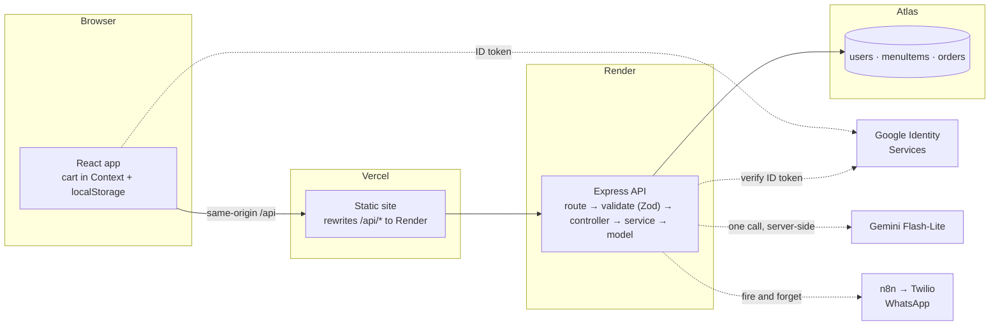

# Aji's Kitchen

Home-made Maharashtrian catering, ordered online. A customer browses the menu,
fills a cart, asks for a date and a time of day, and Aji accepts or declines the
order from her own dashboard.

> **browse → cart → place order → Aji accepts → the customer sees the status**

There is no rider network, no live tracking, no payment gateway and no
automated capacity engine. **Aji is the availability check**: she knows what she
can cook on a given day better than any algorithm would, so the app records
what the customer wants and lets her decide.

## Stack

| | |
|---|---|
| Client | Vite · React 19 · TypeScript · Tailwind CSS v4 · shadcn/ui · TanStack Query · React Router · Motion |
| Server | Node · Express 5 · TypeScript · Mongoose · Zod |
| Database | MongoDB Atlas (free M0), three collections |
| Auth | Google Identity Services → server-verified ID token → our own JWT in an httpOnly cookie |
| AI | Gemini Flash-Lite, server-side only, with a deterministic fallback |
| Notifications | n8n webhook seam (optional, fire-and-forget) |
| Deploy | Vercel (client) · Render (API) · Atlas (database) |

## Architecture



Layering is strict on the server: a route validates its input with Zod before
the handler runs, controllers unwrap the request, **services hold the business
logic**, and models are the only thing that touches the database. Handlers
`throw`; one central error handler turns everything into the same shape:

```json
{ "error": { "code": "CART_CONFLICT", "message": "…", "details": { "conflicts": [] } } }
```

## The part worth reading: two customers, the last box

Read-then-write oversells. Two requests both read "1 left", both decide that's
enough, and both write 0 — two orders, one box of faral. Wrapping it in a
transaction would work, but there's a cheaper answer at this size: put the
conditions and the subtraction in **one** document update, which MongoDB
applies atomically.

```ts
MenuItem.findOneAndUpdate(
  {
    _id: menuItemId,
    isDeleted: false,
    isAvailable: true,
    price: expectedPrice,                                   // price hasn't moved
    $or: [{ stockCount: null }, { stockCount: { $gte: quantity } }],
  },
  [{ $set: { stockCount: {                                  // update pipeline
      $cond: [{ $eq: ["$stockCount", null] }, null, { $subtract: ["$stockCount", quantity] }],
  } } }],
  { returnDocument: "after", updatePipeline: true },
);
```

Whoever loses the race fails the filter and gets `null` back; the service
re-reads the dish to say exactly *why* and returns a 409 with the diff. If a
later line in the same order fails, every unit already taken is put back.

Two details that only show up when you build it:

- **`$inc` cannot be used here.** `stockCount` is `null` for made-to-order
  dishes, and `$inc` on a null field throws *"Cannot apply $inc to a value of
  non-numeric type"*. The `$cond` pipeline handles both cases in one query.
- **Nullable stock is the honest model.** Most catering is made to order, so
  unlimited is the default. Only things that physically exist in a batch —
  twenty-one modak steamed this morning — carry a number.

Proven by test, not by argument: ten concurrent orders for the last box →
exactly one 201, nine 409s, stock lands on zero.
[`tests/stock-race.test.ts`](server/tests/stock-race.test.ts)

## Six questions, answered from the code

**1. How do you stop two customers buying the last unit at the same moment?**
The single conditional update above. One round trip, atomic at the document
level, no transaction. [`order.service.ts`](server/src/services/order.service.ts)

**2. Why is `priceAtOrder` stored on the order line instead of joined from the
menu?** Because if Aji raises the price of sabudana vada in November, an order
placed in October must not change. Name and price are copied at order time and
never joined at read time. There's a test for exactly that.

**3. A customer has the menu open when Aji changes a price — what happens at
checkout?** `POST /api/orders` re-reads every dish and collects *every*
problem — gone, switched off, not enough stock, price moved, below the
minimum — then returns **409** with the diff. The UI explains each change in
plain words and offers "Update my cart". A stale page is harmless because the
server revalidates at the moment of commit.

**4. What if the Gemini call fails or returns something that isn't JSON?** A
deterministic fallback takes over: guest count and keywords matched against
tags and categories. Three things keep the model honest — the prompt is given
the exact ids it may use, the reply is schema-validated and every unknown id is
dropped, and prices are recomputed from the database. The model suggests *what*
and roughly *how much*; the server decides what it costs.
[`ai.service.ts`](server/src/services/ai.service.ts)

**5. Why JWT in an httpOnly cookie rather than localStorage?** Script can't read
it, so an XSS bug can't walk off with the session. `SameSite=Lax` is the CSRF
defence, and it's enough because the client and API share an origin — Vite's
proxy in dev, Vercel's rewrite in production. The role is re-read from the
database on every request rather than trusted from the token, so a change takes
effect immediately.

**6. How would this change with fifty kitchens?** Availability would stop being
one person's judgement, so slots and capacity per kitchen become real, stock
moves to its own service with a reservation TTL rather than a decrement, orders
get partitioned by kitchen, and the notification hop needs a queue with retries
instead of fire-and-forget. None of that is worth building for one grandmother.

## Data model

Three collections. That is the whole database.

- **`users`** — `googleId`, name, email, phone, `role: "customer" | "owner"`,
  embedded addresses. Aji's account is the only owner, decided by `OWNER_EMAIL`.
- **`menuItems`** — dish, Marathi name, category, `unitLabel`, `price` (paise),
  `minQuantity`, `servesApprox`, `isAvailable`, **nullable `stockCount`**,
  `tags` (what the AI matches against), `isDeleted` for soft deletes.
- **`orders`** — line snapshots (`nameSnapshot`, `priceAtOrder`,
  `stockDecremented`), total, `requestedFor: { date, slot }`, address snapshot,
  status, `ownerNote`, `decidedAt`.

**Order status — four states, one decision:**

```
PLACED ──accept──▶ ACCEPTED     (Aji; fires the WhatsApp message)
   │
   ├──decline───▶ DECLINED      (Aji, with a reason; stock goes back)
   └──cancel────▶ CANCELLED     (the customer, while still PLACED)
```

Every change goes through one `transitionOrder()`: it checks an explicit
allow-map, writes conditionally on the status it just read (so a cancel and a
decline arriving together can't both succeed and restore the same stock twice),
restores stock, then calls the notification hook. That's why the WhatsApp
integration has exactly one place to plug into.

**Money is an integer count of paise** everywhere — database, API, DTOs. Rupees
exist only at the UI edges.

**Dates are IST calendar strings** (`"2026-09-22"`), so a server running in UTC
on Render can't shift someone's order to the wrong day.

## Running it locally

Node 22+.

```bash
npm run install:all
```

1. `server/.env` from `server/.env.example`: `MONGODB_URI`, `JWT_SECRET`,
   `OWNER_EMAIL`, `GOOGLE_CLIENT_ID`, `GEMINI_API_KEY` (optional — without it
   the planner uses its fallback).
2. `client/.env` from `client/.env.example`: `VITE_GOOGLE_CLIENT_ID`.
3. `npm --prefix server run seed` — 29 placeholder dishes from
   [`menu.seed.json`](server/data/menu.seed.json). Edit that file (prices in rupees)
   to put in Aji's real menu.
4. `npm run dev` — client on :5173, API on :4000.

**Google OAuth setup:** create a Web client and add `http://localhost:5173` and
`http://localhost` as *Authorised JavaScript origins*. There is no redirect URI
and no client secret — the browser gets an ID token from Google Identity
Services and the server verifies it against Google's public keys, checking that
the audience is our own client ID.

```bash
npm test                      # 80 server tests, in-memory MongoDB, no network
npm --prefix client test      # cart reducer, availability rules, money
npm run typecheck
npm run build
```

Two dev-only helpers for exercising the flow without a Google account:
`npm --prefix server run dev:session` (prints a session token to paste as a
cookie) and `npm --prefix server run dev:poke -- "Besan Ladoo" price 3000`
(changes one dish behind a live cart to trigger the 409 screen).

## API

Public: `GET /api/menu`, `GET /api/menu/:id`
Auth: `POST /api/auth/google`, `GET /api/auth/me`, `POST /api/auth/logout`
Customer: `PATCH /api/users/me`, `POST|DELETE /api/users/me/addresses[/:id]`,
`POST /api/orders`, `GET /api/orders/me`, `GET /api/orders/:id`,
`POST /api/orders/:id/cancel`, `POST /api/ai/suggest`
Owner: `GET /api/owner/orders`, `PATCH /api/owner/orders/:id/status`,
`POST|PATCH|DELETE /api/owner/menu[/:id]`, `GET /api/owner/stats`
Plus `GET /api/health`.

A Postman collection is in [`docs/`](docs/aji-kitchen.postman_collection.json).

## Deploying

See [docs/DEPLOY.md](docs/DEPLOY.md). WhatsApp notifications are optional and
deliberately deferred — [n8n/README.md](n8n/README.md) explains the workflow and
why Meta's template rules make it a demo feature rather than a production one.

## Still to do

- Aji's real menu, prices and "serves approximately" numbers.
- Real photographs of her food; the app currently draws a plate with the dish's
  Marathi name.
- Cloudinary upload in the menu manager (it takes an image URL until then).
